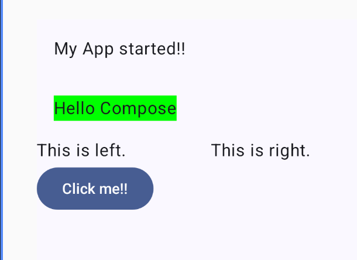
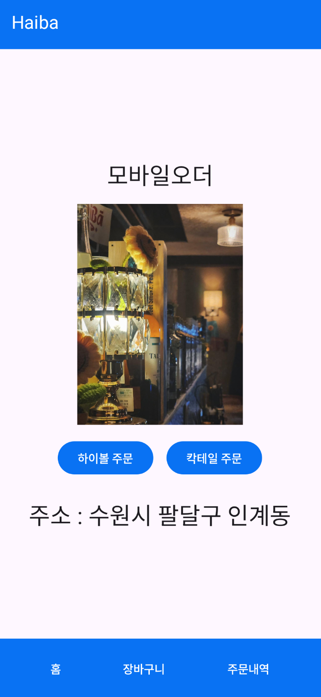
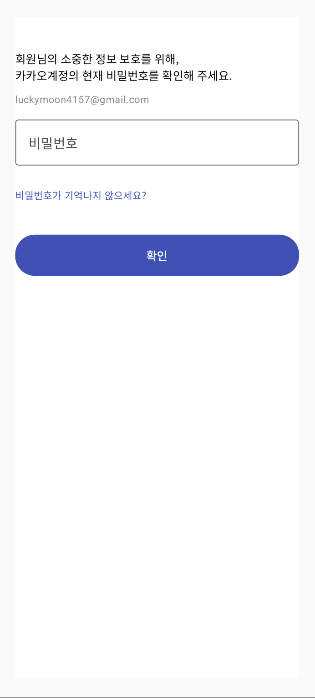
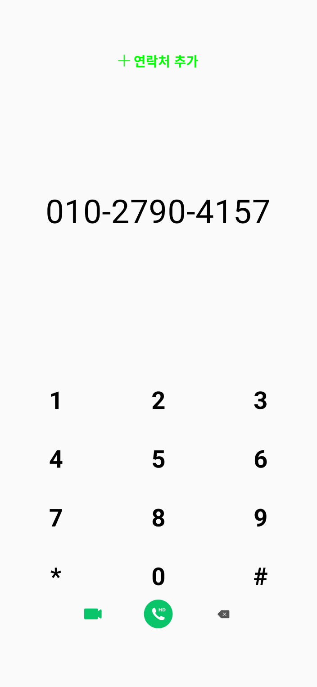
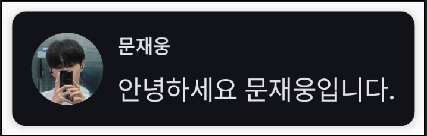
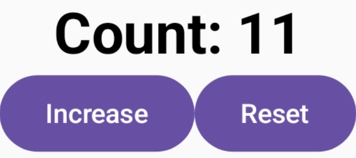
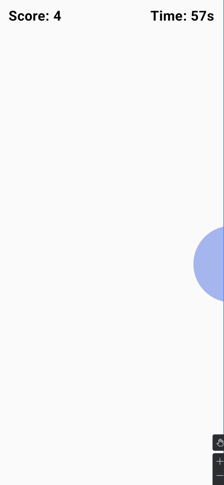

# 모바일앱실습

# 1. 개요
이 프로젝트는 Jetpack Compose를 기반으로 한 안드로이드 UI 개발 실습 과제이다.
각 주차별로 독립된 모듈로 구성되어 있으며, 기본 UI 구성부터 상태 관리, 코루틴, Canvas 등을 학습하고 구현했다.

# 2. 개발 환경
- IDE : Android Studio (2025.01.04 Build)
- Language : Kotlin
- UI Framework : Jetpack Compose
- Minimum SDK : API 32 (Android 12L)
- Emulator : Pixel 9 Pro XL (Android 16, API 36)

# 3. 주차별 실습 내용

## 3.1. w01

### 3.1.1. 학습내용
- Android Studio 설치 및 기본 구성 이해
- 첫 번째 앱 실행
- SDK, AVD 설치 및 가상 디바이스 설정
- Compose 프로젝트 생성 및 Preview 기능 사용법 학습

### 3.1.2. 결과물

## 3.2. w03

### 3.2.1. 학습내용
- Column, Row, Box 등 기본 레이아웃 이해
- Text, Button, TextField 등 UI 구성 요소 실습
- MaterialTheme를 이용한 스타일 적용

### 3.2.2. 결과물

## 3.3. w04

### 3.3.1. 학습내용
- 프로필 화면 구성 (clip(CircleShape), Image 등 활용)
- 전화 키패드 UI 구현 (Row, Column, Box 중첩)
- 정렬 및 간격 조정 (Arrangement, Alignment 활용)

### 3.3.2. 결과물

## 3.4. w05

### 3.4.1. 학습내용
- remember, mutableStateOf를 이용한 상태 유지
- 버튼 이벤트(onClick) 및 값 변경 처리
- LaunchedEffect와 delay()를 이용한 비동기 타이머 구현

### 3.4.2. 결과물

## 3.5. w06

### 3.5.1. 학습내용
- Canvas를 이용한 커스텀 드로잉
- Modifier.clickable을 통한 터치 이벤트 감지
- 점수 및 시간 제한이 있는 버블 터치 게임 제작
- LaunchedEffect를 통한 타이머 및 상태 관리

### 3.5.2. 결과물

